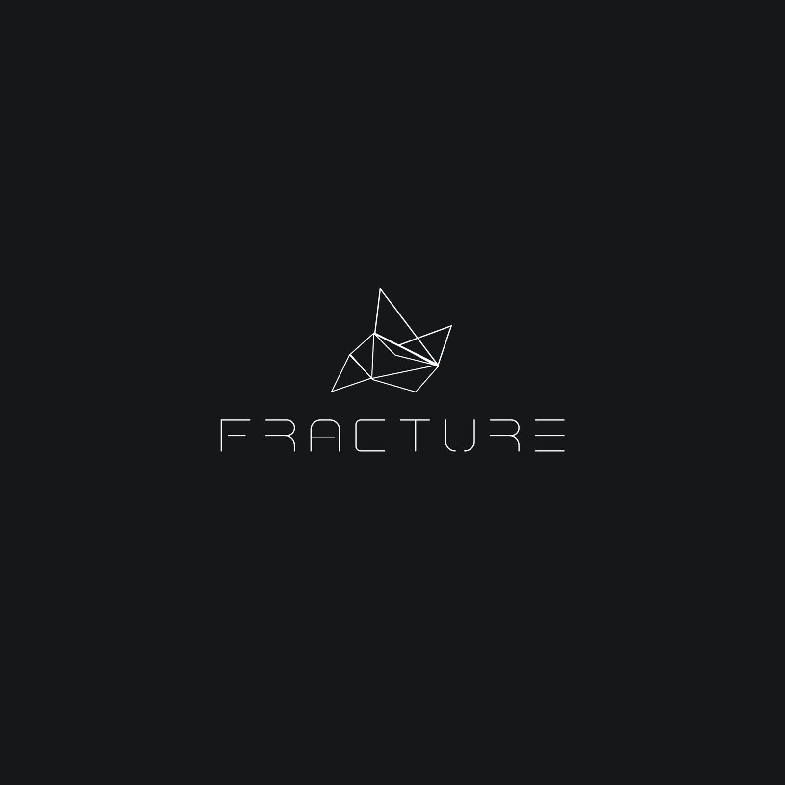

# Fracture
Fracture Game Engine

[![NPM Version][npm-image]][npm-url]
[![Build Status][travis-image]][travis-url]

One to two paragraph statement about your product and what it does.

## Usage

Sorry as this is my personal project there is no real plan to release this for usage by others. I am currently using this project as a platform to learn C++ and Opengl and games programming. 

## Libraries 

Describe how to install all development dependencies and how to run an automated test-suite of some kind. Potentially do this for multiple platforms.

* Assimp
* SDL2
* GLAD
* Bullet Physics 

## Release History

* 0.0.1
    * Work in progress

## Meta

Your Name – [@ndabzie](https://twitter.com/ndabzie?s=09)

Distributed under the XYZ license. See ``LICENSE`` for more information.

[https://github.com/yourname/github-link](https://github.com/dbader/)

<!-- Markdown link & img dfn's -->
[npm-image]: https://img.shields.io/npm/v/datadog-metrics.svg?style=flat-square
[npm-url]: https://npmjs.org/package/datadog-metrics
[npm-downloads]: https://img.shields.io/npm/dm/datadog-metrics.svg?style=flat-square
[travis-image]: https://img.shields.io/travis/dbader/node-datadog-metrics/master.svg?style=flat-square
[travis-url]: https://travis-ci.org/dbader/node-datadog-metrics
[wiki]: https://github.com/yourname/yourproject/wiki
